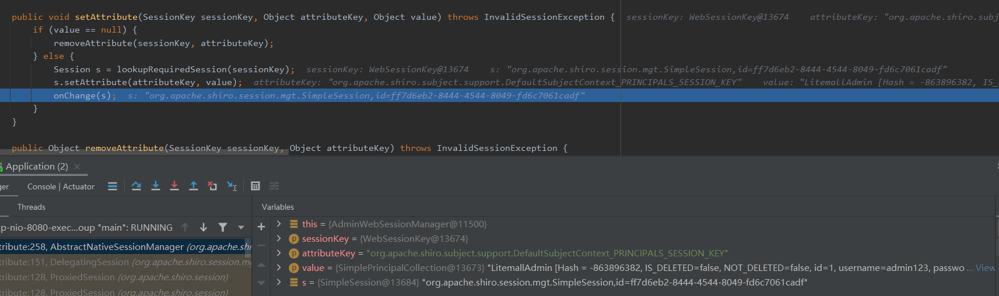
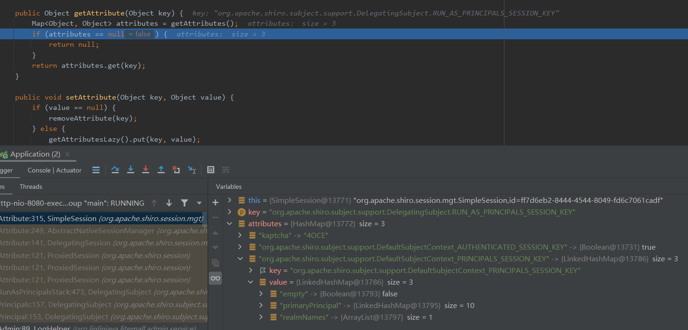

项目背景: 为实现状态共享以及方便项目以后水平扩容, 欲将验证授权数据以及session缓存到集中式缓存redis中. 

因为项目使用的是shiro, 而市面上相关整合shiro与redis的开源框架shiro-redis存在两个问题:

1. 框架底层另外创建了jedis客户端操作redis, 如果项目本身使用了spring-data-redis, 将同时存在多个客户端, 并且不能利用高版本spring-data-redis中更高性能的Lettuce;
2. 项目中如果使用了spring-devtools, 因为其实现原理为通过不断替换RestartClassloader来实现热加载, 与shiro-redis对存入redis的对象使用jdk原生反序列化, 生成的对象被新替换的RestartClassloader加载, 会导致Subject#getPrincipal方法获取主体并强转失败, 报错ClassCastException

> 全限定类名与其类加载器决定类是否相同

既然是jdk原生序列化与devtools的冲突, 但又不想放弃devtools, 那么能不能通过改变序列化方式来实现?

市面上大多框架如shiro-redis、spring-session都是默认使用JDK序列化的方式实现共享session, 而为什么不采用更快更小的json存储肯定是有其原因的, 据说是因为Session通常要在attributes中存储对象, 而使用json反序列化时无法确定具体对象具体类型.

本着不见棺材不落泪的精神, 我开始尝试起了json序列化之路:

shiro并没有直接使用servlet中的session, 而是自己定义Session接口, 实际使用的是SimpleSession, 所以我们的关键为对该类对象进行json序列化....

1.该类中有如下transient属性:

```java
    private transient Serializable id;
    private transient Date startTimestamp;
    private transient Date stopTimestamp;
    private transient Date lastAccessTime;
    private transient long timeout;
    private transient boolean expired;
    private transient String host;
    private transient Map<Object, Object> attributes;
```

但这对该类对象通过jdk原生序列化是能序列化这些属性的, 原因在这些属性上面有进行说明, 主要是通过writeObject和readObject方法完成序列化, 这也是为什么shiro-redis源码中使用的JDK原生序列化的原因.

> 另外, shiro-redis为了避免频繁读取redis中的session进行反序列化, 在RedisSessionDAO中使用SessionInMemory类实现单词请求连续多次读从ThreadLocal中访问, 在每次SessioDao操作前删除过期的ThreadLocal中的session.
> 
> 我们可能还需要考虑shiro对session的频繁更新, 最频繁变化的内容为lastAccessTime属性, 一旦session中有属性变化, 都会触发写redis更新session

2.若使用Jackson进行序列化, 会发现多出来两个属性valid和attributeKeys, 是因为Jackson获取json属性是通过getXxx.

---------------------------------------

巴拉巴拉进行了一堆配置, 调了一整天, 最后在登录的时候找到了问题: 序列化容易, 但是反重点在于反序列化上面, 见下图:



shiro在登录后会对Principals进行合并, 然后封装为一个SimplePrincipalCollection存入Session的attributes中, 然后shiro会对改变了的session通过sessionDao写入redis.

在反序列化时, 我将attributes作为map进行转换, 但是对于其里面的值对象, 是无法预知其类型而反序列化为指定对象, 因此出现了取出来为LinkedHashMap的情况:



最后的结果可想而知, 等待我的就是类型转换错误:

```java
java.util.LinkedHashMap cannot be cast to org.apache.shiro.subject.PrincipalCollection
```

见到了棺材, 接下来还是考虑其他方案吧...

老老实实改成了字节流序列化方式....

~~在启动类或配置类上加入@Import(ShiroRedisConfiguration.class)即可s使用里面注入的RedisCacheManager和RedisSessionDao了.~~

现在只是初步实现, 待优化 >...<
